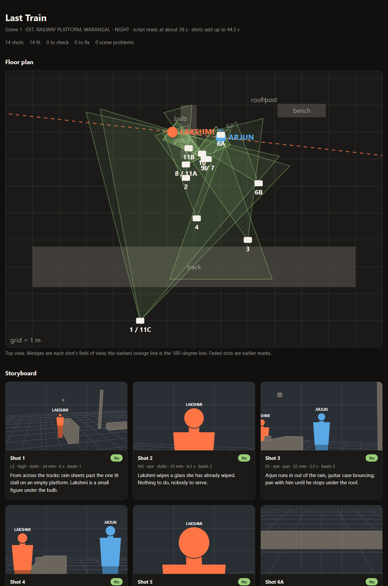

<p>
  <a href="LICENSE"></a>
  
  <a href="https://github.com/summerrise-studios/frame/actions/workflows/tests.yml"></a>
  <a href="https://www.summerrise.studio"></a>
</p>

# Frame

**See the scene before the set.**

Frame helps directors previsualize a scene before the set is built: from a script page to a checked shot plan, a floor plan and a storyboard.

## The idea

Seeing a scene before it's built lets a director make decisions about framing, light, and staging while changes are still cheap.

## The prototype



The first prototype turns one screenplay scene into a shot plan you can check
and see:

- **Claude plans the shots.** In [Claude Code](https://claude.com/claude-code),
  the [`frame` skill](.claude/skills/frame/SKILL.md) has Claude block the scene,
  then choose each shot's size, lens, angle, move and camera position.
- **The `frame` tool checks them with real camera geometry.** It reads the
  script ([Fountain](https://fountain.io) format), works out what each lens
  actually sees from where the camera stands, and flags:
  - subjects that fall outside the frame;
  - a size the lens and distance can't give (a "CU" that's really a medium shot);
  - shots that cross the 180-degree line and would flip screen direction;
  - possible jump cuts, uncovered beats, unseen speakers, and pacing that's far
    off the script's length.
- **It draws the result:** a top-down floor plan with every camera and its
  field of view, and a storyboard frame for each shot, projected through that
  shot's lens.

Worked example, an original scene called *Last Train*:
[script](examples/last-train/scene.fountain) ·
[shot plan](examples/last-train/shots.json) ·
[previz page](examples/last-train/previz.html) (download it and open it in a browser).

### Try it

Needs Python 3.10 or newer. There are no other dependencies.

```bash
git clone https://github.com/summerrise-studios/frame.git
cd frame
pip install -e .
frame scene examples/last-train/scene.fountain
frame check examples/last-train/scene.fountain examples/last-train/shots.json
frame render examples/last-train/scene.fountain examples/last-train/shots.json
```

To plan your own scene, open the repository in Claude Code and ask:
*"Use the frame skill to plan the shots for scenes/my-scene.fountain"*.

### Limits

- Storyboard frames are schematic: simple figures and boxes, not rendered images.
- The geometry assumes a Super 35 sensor at 16:9 and people as simple shapes.
- Characters hold one mark per beat; moves within a shot aren't animated yet.
- One scene per shot plan. Lighting isn't modelled yet.
- Only use scripts you wrote or have the rights to.

## Status

**Early prototype.** Parsing, the camera checks and the drawing work and are
tested; the shot planning runs through Claude Code. Watch this repository, or
[join the list](https://www.summerrise.studio/#contact) to hear about demos,
releases and research notes.

## Contributing

Ideas, feedback, and research pointers are welcome: [open an issue](https://github.com/summerrise-studios/frame/issues/new/choose). Please read the [contributing guide](https://github.com/summerrise-studios/.github/blob/main/CONTRIBUTING.md) and [code of conduct](https://github.com/summerrise-studios/.github/blob/main/CODE_OF_CONDUCT.md) first. To report a security problem, follow the [security policy](https://github.com/summerrise-studios/.github/blob/main/SECURITY.md).

## License

Frame is open source under the [GNU Affero General Public License v3.0](LICENSE).
You can use, study, change, and share it. If you run a modified version as a
network service, you must offer its users the source code of your changes.

For hosted plans, support, or commercial licensing, contact
[jampanikomal@summerrise.studio](mailto:jampanikomal@summerrise.studio).

---

Built by [Summer Rise Studios](https://www.summerrise.studio) · [LinkedIn](https://www.linkedin.com/company/summerrise-studios) · [X](https://x.com/SummerRiseStudi) · [Instagram](https://www.instagram.com/summerrisestudios/)
